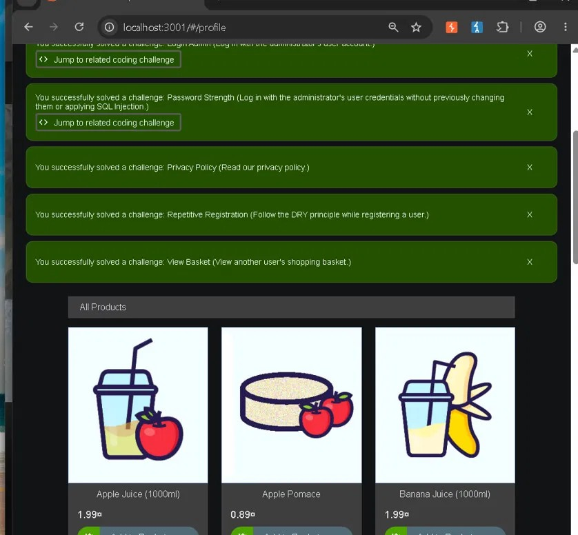
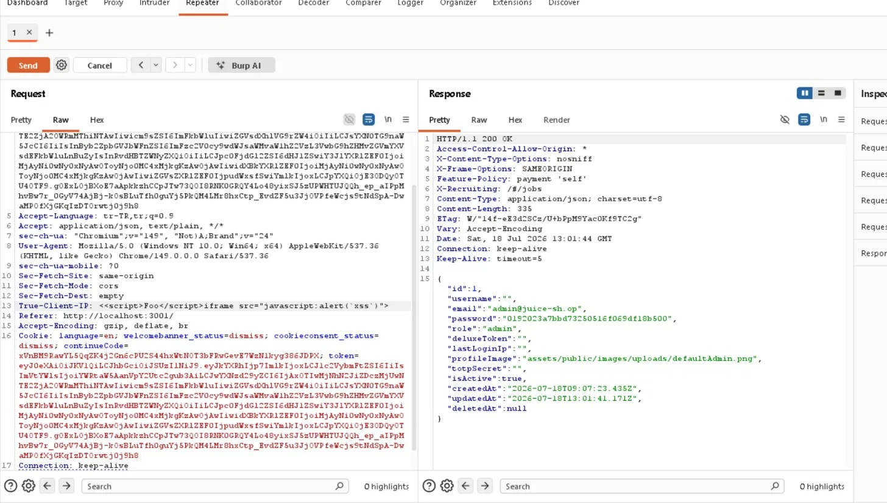
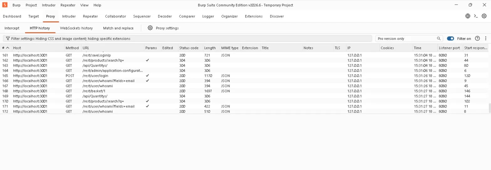

# XSS Attack & Defense Lab

Hands-on web application security research focused on **Cross-Site Scripting (XSS)** and related
injection vulnerabilities. All testing was performed against **OWASP Juice Shop** (a deliberately
vulnerable, official OWASP training application), self-built local labs, and PortSwigger Web
Security Academy.

The goal was not to collect scoreboard points, but to **understand the mechanisms** behind each
vulnerability class using a repeatable *source → sink* methodology — and to be able to explain every
step, not just paste a payload.

> ⚠️ **Scope & ethics.** Every test in this repository was carried out **only** on authorized,
> local, intentionally-vulnerable targets (OWASP Juice Shop running locally via Docker on
> `localhost:3001`, self-authored HTML labs, and PortSwigger Academy labs). Nothing here targets
> any real, third-party, or production system. These techniques must only ever be used on systems
> you own or are explicitly authorized to test.

---

## What this repository shows

- A consistent **methodology** for finding and reasoning about client-side and server-side
  injection bugs (see [`methodology.md`](methodology.md)).
- **Findings** across multiple XSS classes plus SQL Injection and IDOR, including both *positive*
  results (working exploits) and *negative* results (where a defense held — also a valid finding).
- Self-authored **local labs** that isolate advanced/"next-gen" XSS classes that Juice Shop does not
  expose (see [`labs/`](labs/)).
- A clear link between **attack** and **defense**: each finding is paired with a remediation, and
  [`defense/`](defense/) collects the secure-coding fix for every class in one place.
- **Independent, real-world research** applying the same method to third-party open-source software,
  with externally-validated results and coordinated disclosure (see
  [`research/`](research/) — *Beyond the Lab*).

---

## Tools

| Tool | Use |
|------|-----|
| **Burp Suite** (Community) | Proxy to capture requests; **Repeater** to modify and resend raw HTTP; header injection; API testing without the frontend |
| **Chrome DevTools (F12)** | **Elements** (verify raw HTML vs escaped in the DOM), **Console** (proof of execution), **Network** (request/response inspection) |
| **OWASP Juice Shop** (Docker) | Primary authorized target |
| **PortSwigger Web Security Academy** | Additional labs (CSP bypass, client-side prototype pollution) |

---

## Methodology (short)

```
1. SOURCE   – find every attacker-controllable input (URL params, form fields, API fields, headers, file names)
2. SINK     – find where that data is rendered / written (innerHTML, bypassSecurityTrustHtml, a DB field, a file)
3. PROBE    – send an inert marker (<b>test) and check the DOM: is it a real element (raw) or escaped text?
4. ESCALATE – if raw, move up one rung: , <iframe src=javascript:>, <svg onload>, or a sanitizer bypass
5. VERIFY   – prove execution cleanly with console.log(document.domain) before any noisy alert()
6. AUTHZ    – check whether the action even required the privilege used (is there also an access-control bug?)
```

**Key decision — network or browser?**
A vulnerability that stays in the browser (DOM-based XSS, mutation, clobbering, prototype pollution)
is analysed from **DevTools (Console / Elements)** — the Network tab is empty because the payload
never reaches the server. A vulnerability that travels to the server (reflected, stored, header,
API) is analysed from the **Network / Burp** side (payload vs. response). Picking the right layer is
half the work.

Full write-up: see [`methodology.md`](methodology.md).

---

## Findings

**Results at a glance:** eight working vulnerabilities were confirmed on OWASP Juice Shop — an
account-takeover-capable DOM XSS, four stored-XSS paths (feedback, Zip Slip, registration API, and a
header-based one), a CSP bypass, SQL Injection and an IDOR — plus advanced classes demonstrated in
self-authored labs.

Legend — **Confirmed**: working exploit reproduced · **Lab**: demonstrated in a self-authored isolated
lab · **Academy**: PortSwigger lab.

| # | Vulnerability | Target | Status | Core mechanism |
|---|---------------|--------|--------|----------------|
| 1 | **DOM-based XSS** (search `?q=`) | Juice Shop | ✅ Confirmed | `q` flows into a `bypassSecurityTrustHtml` → `[innerHTML]` sink; `` executes on the resource-load-failure path (which the "inserted `<script>` won't run" rule doesn't cover) |
| 2 | **Stored XSS — sanitizer bypass** (feedback) | Juice Shop | ✅ Confirmed | A single-pass filter strips `<script>Foo</script>`; the deletion **re-forms** a valid `<iframe src=javascript:>` (mutation) |
| 3 | **Stored XSS — Zip Slip** (subtitle overwrite) | Juice Shop | ✅ Confirmed | Path-traversal in a `.zip` upload overwrites `owasp_promo.vtt`; the `/promotion` page renders the subtitle unsanitized |
| 4 | **Stored XSS — registration API → admin panel** | Juice Shop | ✅ Confirmed | Posting an `<iframe>` email straight to `/api/Users` skips client-side validation; the admin "Registered Users" table renders it raw |
| 5 | **CSP Bypass** (profile page) | Juice Shop / Academy | ✅ Confirmed | User input is reflected into the CSP header; injecting a permissive `script-src` re-opens inline execution (also solved on the PortSwigger CSP lab) |
| 6 | **SQL Injection** (product search `?q=`) | Juice Shop | ✅ Confirmed | `UNION SELECT` breaks out of the query and exfiltrates user emails + password hashes from the `Users` table |
| 7 | **IDOR / BOLA** (`/rest/basket/{id}`) | Juice Shop | ✅ Confirmed | Server authenticates the token but does not verify object ownership; changing the basket id returns other users' baskets |
| 8 | **Stored XSS — HTTP header** (`True-Client-IP`) | Juice Shop | ✅ Confirmed | Header reaches `lastLoginIp` behind an allowlist sanitizer; a **nested-tag mutation** (same technique as #2) bypasses it and the payload fires on the Last Login IP page |
| 9 | **mXSS (Mutation XSS)** | Local lab | ✅ Lab | Browser mutates `<image>` → `` on an `innerHTML` round-trip, defeating a filter that only blocks `` |
| 10 | **DOM Clobbering** | Local lab | ✅ Lab | An `<a id="isAdmin">` element shadows a `window.isAdmin` global — access-control bypass with **zero script** |
| 11 | **Prototype Pollution → XSS** | Local lab / Academy | ✅ Lab / Solved | `__proto__[x]=y` in a query string pollutes `Object.prototype`; a gadget then reaches an `innerHTML` sink |
| 12 | **jQuery-specific XSS** | Local lab | ✅ Lab | `$(userInput)` selector-to-HTML, `.html()` sink, and `$.extend(true, …)` prototype pollution (CVE-2019-11358) on jQuery 3.3.1 |

---

## Evidence

Selected captures — the full per-finding walkthrough (payloads, steps, remediation) is in the
[report](report/OWASP-JuiceShop-Security-Assessment.pdf).

**OWASP Juice Shop Score Board** — solved challenges including *Login Admin*, *Password Strength*
(SQL Injection / weak credentials) and *View Basket* (IDOR):



**Burp Suite Repeater** — editing and resending a request during header / API injection testing:



**Burp Proxy HTTP history** — locating the target requests (`/rest/saveLoginIp`, `/api/*`) before
replaying them in Repeater:



More captures in [`screenshots/`](screenshots/).

---

## Beyond the lab — real-world research

The lab work above builds the fundamentals; I then applied the **same source → sink discipline to real
third-party open-source software** (WordPress.org plugins) — reading code for logic and access-control
flaws, patch-diffing recent fixes to find the variants a developer missed, and **verifying every
hypothesis in a local Dockerized environment** before believing it.

That research **independently produced externally-validated findings** — including a Broken-Access-Control
vulnerability confirmed as genuine by **Patchstack** (a CVE Numbering Authority), and a SQL-injection
variant, re-derived via patch-diffing, that was subsequently published as a CVE.

All of it on **public open-source code, verified only in local labs, disclosed responsibly** — no
unpatched details are published. Full methodology and honest results: [`research/`](research/).

---

## Key insights

- **The render decides, not the response.** Seeing raw HTML in an HTTP response does *not* mean XSS
  exists — the code that prints the value must also use a dangerous render. Juice Shop stores raw
  `<b>` in reviews, yet Angular auto-escapes it on render → safe. Conversely the search sink opts out
  of escaping (`bypassSecurityTrustHtml`) → exploitable.
- **Filtering alone is not protection.** A blacklist/single-pass sanitizer can be defeated because
  *removing* a tag can re-form a new dangerous one (findings #2 and #8). Real protection is output
  encoding + a tested DOM-based sanitizer (DOMPurify / sanitize-html) + recursive sanitization + CSP.
- **Client-side validation is not security.** The registration-API XSS (finding #4) skips the form's
  checks entirely by posting straight to the API — validation must be enforced, and output encoded, on
  the server.
- **`<script>` inserted via `innerHTML` does not execute** — escalation needs an event-handler
  attribute (`onerror`) or a `javascript:` URL scheme, a different code path.

---

## Remediation summary

| Class | Fix |
|-------|-----|
| DOM XSS (`bypassSecurityTrustHtml`) | Remove the bypass; rely on auto-escaping; use `DomSanitizer.sanitize` / DOMPurify if raw HTML is truly required |
| Sanitizer bypass / mXSS | Allowlist over blocklist; a tested DOM-based library; idempotent single-parse; recursive sanitization |
| DOM Clobbering | Read via `getElementById` not the global namespace; `Object.create(null)` for lookup maps |
| Prototype Pollution | Guard `__proto__`/`constructor`; `Object.freeze(Object.prototype)`; update libraries |
| CSP | Strict CSP + nonce; **never reflect user input into a security header** |
| jQuery | Prefer `.text()`; never pass user input to `$()`; upgrade to ≥ 3.5 |
| SQL Injection | Parameterized queries / ORM bindings; never concatenate input into SQL |
| IDOR / BOLA | Enforce per-object authorization (`resource.ownerId === session.userId`) on every request |
| Zip Slip | Validate/normalize archive entry names; reject `../`; extract only within the target directory |
| Sessions | `HttpOnly` + `Secure` + `SameSite` cookies; keep tokens out of `localStorage` |

---

## Repository structure

```
xss-attack-defense-lab/
├── README.md          – this file
├── methodology.md     – the full source → sink hunting method
├── research/          – Beyond the Lab: independent real-world research + validated results
├── report/
│   └── OWASP-JuiceShop-Security-Assessment.pdf   – full report (per-finding steps, impact, remediation)
├── screenshots/       – selected evidence captures (Burp, DevTools, Juice Shop)
├── defense/           – written secure-coding defenses for every vulnerability class
└── labs/              – self-authored, isolated labs for advanced XSS classes
    ├── mxss-lab.html
    ├── clobber-lab.html
    ├── protopollution-lab.html
    └── jquery-lab.html
```

📄 **Full report:** [`report/OWASP-JuiceShop-Security-Assessment.pdf`](report/OWASP-JuiceShop-Security-Assessment.pdf)
— executive summary, methodology, and each finding with vulnerability class, how it works, the exact
steps taken, impact, and remediation.

📸 **Evidence:** selected captures in [`screenshots/`](screenshots/) (solved challenges, Burp Repeater,
HTTP history, profile/CSP fields).

---

## Disclaimer & License

This repository is for **education and defensive research only**. Every technique was performed on
**authorized, local, intentionally-vulnerable** targets (OWASP Juice Shop, self-authored labs,
PortSwigger Academy). Do **not** use any of it against systems you do not own or are not explicitly
authorized to test — unauthorized testing is illegal.

Released under the [MIT License](LICENSE).

---

*Educational security research · authorized/local targets only.*
