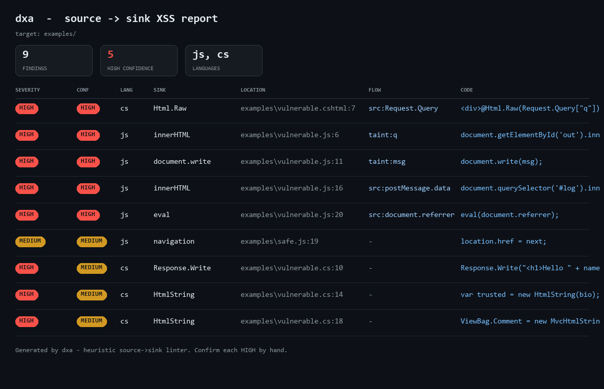

# dxa — source→sink XSS analyzer (full-stack)

[](https://github.com/calsgnkadir/xss-attack-defense-lab/actions/workflows/ci.yml)

A small, dependency-free static linter that flags XSS sources, sinks, and the
likely **source → sink flows** between them — on **both sides** of a web app:

- **client side** — JavaScript / TypeScript (DOM XSS)
- **server side** — C# / ASP.NET & Razor (server-rendered XSS)

It is the `source → sink` methodology from this repository
([`../../methodology.md`](../../methodology.md)) expressed as runnable code.



*The `--html` report: severity/confidence badges, the source→sink flow, and the
offending line for every finding — both JavaScript (DOM XSS) and C#/.NET.*

## What it does

1. **Finds sinks.**
   - *JavaScript:* `innerHTML`/`outerHTML`, `insertAdjacentHTML`,
     `document.write`, `eval`, the `Function()` constructor, string `setTimeout`,
     jQuery `.html()`/`.append()`, `$()` on a variable, `location`/`window.open`
     navigation, `setAttribute` on dangerous attributes, Angular
     `bypassSecurityTrust*`, React `dangerouslySetInnerHTML`.
   - *C# / .NET:* `@Html.Raw()`, `Response.Write()`, `new HtmlString()` /
     `MvcHtmlString`, Blazor `MarkupString`, control `.InnerHtml`.
2. **Finds sources.**
   - *JavaScript:* `location.hash`/`.search`/`.href`, `document.URL`,
     `document.referrer`, `window.name`, `document.cookie`, web storage, URL
     params, `history.state`, `postMessage` data (in files with a `message`
     listener).
   - *C# / .NET:* `Request.Query`/`Form`/`Params`/`Cookies`/`Headers`/`Body`,
     route values.
3. **Taint pass (JS).** A bounded fix-point marks variables assigned from a
   source (or from another tainted variable) as tainted. A sink that consumes a
   tainted value, or a source directly, is raised to **HIGH confidence**; a sink
   on a dynamic-but-untraced value is **medium**; a sink on a pure literal is
   **low**. (C# is sink-detection with source-on-line confidence; no cross-line
   taint — kept deliberately simple and honest.)

## Usage

```bash
python dxa.py <file-or-directory> [--json] [--html FILE] [--min-confidence low|medium|high]
```

Exit code is non-zero when findings are reported, so it can gate CI.

```bash
# scan a single file
python dxa.py examples/vulnerable.js

# scan a project, only the likely-real flows
python dxa.py ../../ --min-confidence high

# machine-readable output
python dxa.py src/ --json

# self-contained HTML report (severity/confidence, source->sink flow, code)
python dxa.py src/ --html report.html
```

### Example

```
$ python dxa.py examples/vulnerable.js
examples/vulnerable.js:6  [HIGH/high confidence]  sink: innerHTML  <- tainted var: q
    value assigned to (inner|outer)HTML is parsed as HTML
    | document.getElementById('out').innerHTML = q;
...
8 finding(s) - 4 at HIGH confidence (a source or tainted value reaches the sink).
```

`examples/vulnerable.js` (flagged) and `examples/safe.js` (the escaped/guarded
equivalents, quiet at `--min-confidence high`) double as a self-test.

## Tests

A `pytest` suite (`test_dxa.py`) locks down the detector's behaviour — taint
propagation, source read-vs-write, the C#/Razor rules, and that guarded/literal
cases are *not* raised to high confidence. It runs in CI on every push (see the
badge above).

```bash
pip install pytest
pytest -q      # from this directory
```

## Honest limitations

This is a **heuristic** — regular expressions plus a light taint pass, *not* a
sound analysis. It does **not** build an AST or a precise data-flow graph, so:

- **False positives:** matches inside comments and strings; a value flagged as
  reaching a sink may actually be validated (e.g. an allowlist the linter can't
  see). `examples/safe.js` shows a guarded `location.href` that is reported at
  medium and correctly disappears at `--min-confidence high`.
- **False negatives:** taint through function calls, aliasing, object
  properties, and template/JSX expressions is not tracked.

Use it to **prioritise** where to look, then confirm each finding by hand with
the browser DevTools workflow described in the repository. It is a triage aid and
a demonstration of the methodology — not a replacement for review.

## Why it exists

The repository documents *how* to reason about DOM XSS. This tool encodes the
first, mechanical half of that reasoning (locate the sources and sinks, connect
them) so the human can spend time on the half that matters: judging exploitability.
